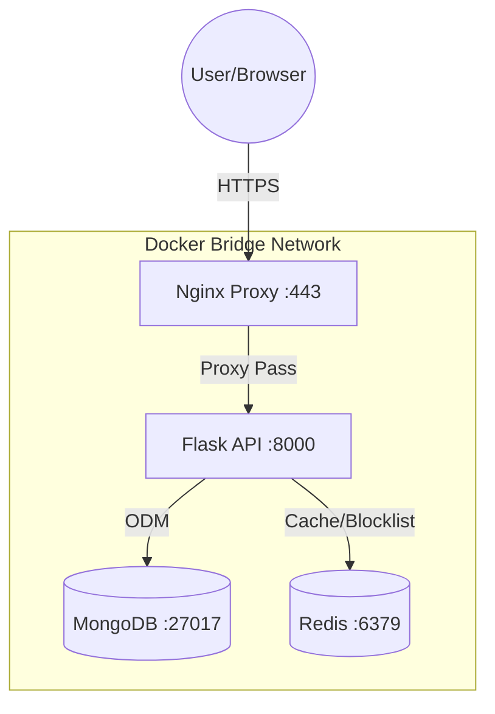
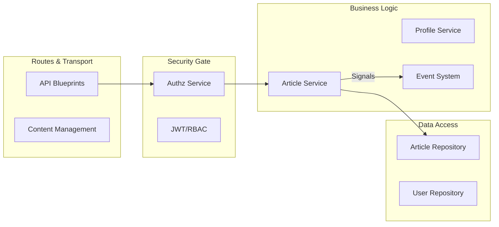

# System Architecture

This document defines the architectural patterns, data flow, and structural boundaries of the Flask Web Project.

## 1. High-Level Container Diagram

The system follows a containerized micro-stack approach, with Nginx acting as the secure gateway.



---

## 2. Internal Component Architecture (The Modular Monolith)

The Python source code (`src/`) is structured to separate concerns, ensuring that business logic is independent of the database and the transport layer.



### Layer Responsibilities:
1.  **Transport (Routes):** Handles HTTP requests, deserializes JSON via Pydantic, and invokes the appropriate Security Gate.
2.  **Security Gate (Authz):** Implements the **"Double Gate"** pattern. It verifies identity via JWT (stateless) and then confirms user existence and permissions via the database (stateful).
3.  **Domain (Services):** The core business logic. Services receive **trusted DTOs** from the Authz layer and perform operations. They are agnostic of HTTP and Database internals.
4.  **Persistence (Repositories):** Encapsulates MongoEngine/Redis queries. Services never talk to `Article.objects` directly; they use the Repository interface.

---

## 3. Core Design Patterns

### A. The "Double Gate" Authorization
To balance performance and security, we use a two-step validation:
1.  **Gate 1 (JWT Claims):** Fast, stateless check of permissions stored in the token.
2.  **Gate 2 (DB Sync):** Verifies the `token_version` against the database. If a user changes their password or role, the version increments, instantly invalidating all existing JWTs.

### B. Interface-Based Mocking
For testing stability, we mandate mocking at the **Repository Interface** level. 
*   **Do not** mock `mongoengine.Document.objects`.
*   **Do** mock `service._article_repository`.
This allows the repository to optimize queries (e.g., adding `.only()` or `.hint()`) without breaking the entire test suite.

### C. Signaling (Blinker)
Side effects (logging article deletions, cleaning up media, auditing logins) are handled via **Signals**. This prevents service methods from becoming bloated with "cleanup" code that isn't core to the business action.

---

## 4. Data Flow: Authenticated Request

1.  **Client** sends request with an `access_token` cookie.
2.  **Nginx** terminates SSL and forwards to **Gunicorn**.
3.  **Flask Blueprint** catches the request and runs `@permission_required`.
4.  **AuthzService** performs the "Double Gate" check.
5.  **Service** executes business logic and dispatches a **Blinker Signal**.
6.  **Listener** handles side effects (e.g., deleting old media files) asynchronously.
7.  **Repository** executes optimized projected query to MongoDB.
8.  **Pydantic** validates the final output before it leaves the API.

---

## 5. Architectural Verification

To objectively confirm that the system design matches this documentation, you can generate automated UML diagrams and run dependency scans.

### A. UML Class Diagrams
Using `pyreverse` (bundled with `pylint`), you can visualize the class relationships and verify the implementation of interfaces.

```powershell
# Generate UML for the Repository Layer
.venv/Scripts/python.exe -m pylint.pyreverse.main src/repositories -o dot -p repositories
```

### B. Dependency Enforcement (Design Gate)
The project includes an automated **Architectural Integrity Gate** that uses Python AST to scan for boundary violations (e.g., repositories importing services). See `docs/TESTING.md` for execution details.
